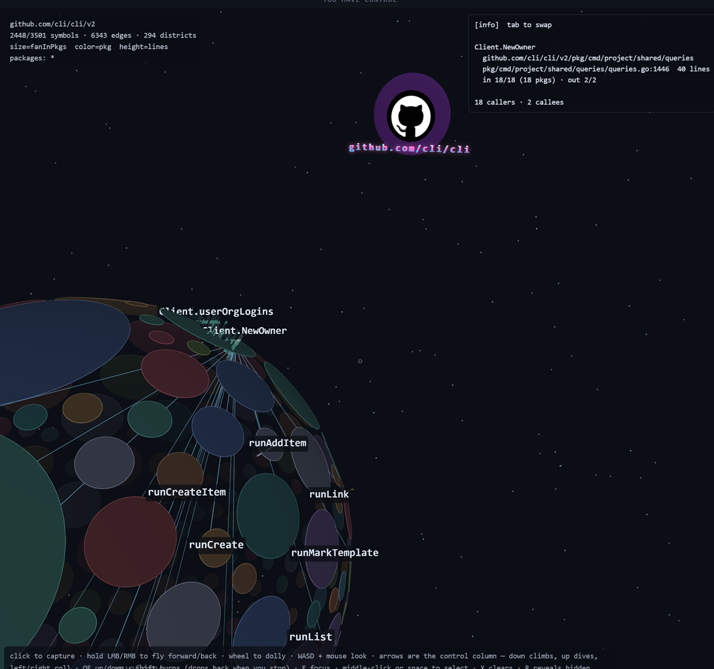
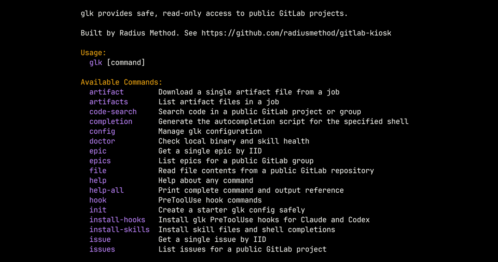
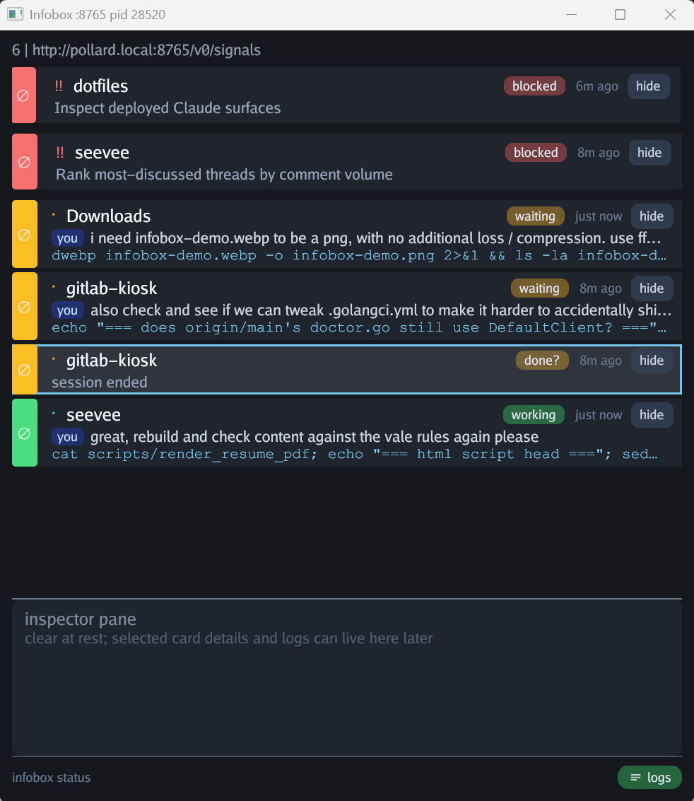

# Hi, I'm Daniel.

I build tools that eliminate incidental complexity.

Most of my work lives at the boundary between software engineering, developer experience, and internal tooling: replacing recurring engineering pain with boring, repeatable systems that shorten feedback loops, reduce uncertainty, and make the right thing the easy thing.

Sometimes that looks like backend services. Sometimes it's Kubernetes platforms, deployment pipelines, AI-assisted workflows, internal developer tools, or a pile of tiny utilities. The technologies change; the goal rarely does.

## What I'm building

Different angles on the same problem: what should the interface look like between a person and an agent doing work on their behalf.

### callscape

A Go module's call graph, as districts you fly through. Every package is a patch of one sphere, every symbol a building sized by how many packages call it. It answers a question I kept failing to answer by reading: what shape is this codebase, and where does it actually hinge. The dumper is a separate binary behind a JSON seam, so the graph is a file anything can read — including a viewer nobody has written yet. Go and three.js, MIT, at [github.com/dpritchett/callscape](https://github.com/dpritchett/callscape).

### gitlab-kiosk

A read-only GitLab CLI for coding agents. GET-only HTTP, public-only visibility checks, pinned host, no credentials by default. Handing an agent raw credentials technically works, but then you're watching every call it makes. These constraints are what let you hand off a task and walk away. Go, Apache-2.0, open source at [github.com/radiusmethod/gitlab-kiosk](https://github.com/radiusmethod/gitlab-kiosk).

### SeeVee

A source-backed career knowledge system that treats resumes, interview preparation, and hiring artifacts as projections of a richer body of evidence instead of hand-edited documents.

### Infobox

A local, scriptable soundboard and digital billboard for active agent work. One Go and Gio binary that owns its state in memory, appends signals to a JSONL log, and accepts producers over a small HTTP API. The running process serves its own schema, so anything that wants to notify me can ask what shape a signal takes.

### beepboop

Deterministic sound pipelines in Go: sources, effects chains, and batch-rendered voice lines, defined in a recipe rather than by hand-editing a WAV. An unchanged recipe rebakes to an empty diff, so audio becomes a build output instead of a binary you're afraid to touch — which is what lets an agent change how something sounds without anyone opening an editor. MIT, at [github.com/dpritchett/beepboop](https://github.com/dpritchett/beepboop).

### beatshop

A lab for writing music rather than generating it — the other half of the sound problem, and the place callscape's soundtrack came from. MIT, at [github.com/dpritchett/beatshop](https://github.com/dpritchett/beatshop).

## Engineering philosophy

These are ideas I keep rediscovering:

- Reduce uncertainty with experiments.
- Fast feedback loops beat heroic effort.
- Production is where the learning starts.
- Build systems that make the right thing the easy thing.
- Eliminate incidental complexity instead of documenting it.
- The computer is an outboard brain. Refactor it accordingly.

## Things I've worked on

Over the years I've built backend systems, internal developer platforms, deployment tooling, ChatOps systems, Kubernetes infrastructure, AI-assisted workflows, and more small utilities than I can count.

A few stops along the way:

- Platform One / Big Bang
- Rebellion Defense
- CrowdStrike
- Gremlin

I also wrote [*Build Chatbot Interactions*](https://pragprog.com/titles/dpchat/build-chatbot-interactions/) for Pragmatic Bookshelf because I've always been interested in helping engineers build better tools for themselves.

## Open source

Most of my public repositories are experiments, utilities, or ideas that escaped into the real world because I got tired of solving the same problem twice.

Don't expect a polished showcase. Expect experiments, tools, prototypes, and evidence of how I think.

## Elsewhere

- Blog: <https://dpritchett.net>
- LinkedIn: <https://linkedin.com/in/danielpritchett>
- Hacker News: <https://news.ycombinator.com/user?id=dpritchett>
